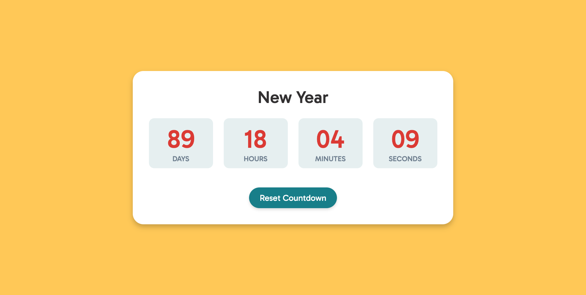
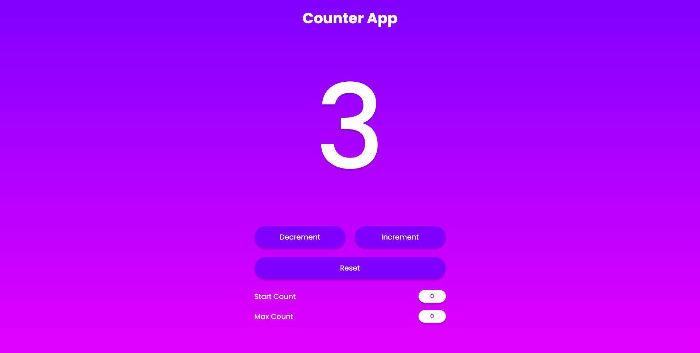
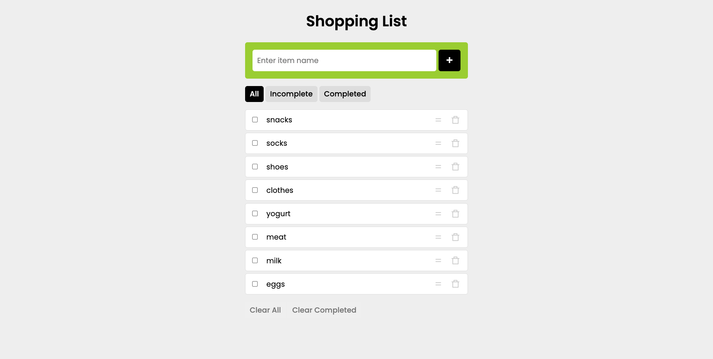
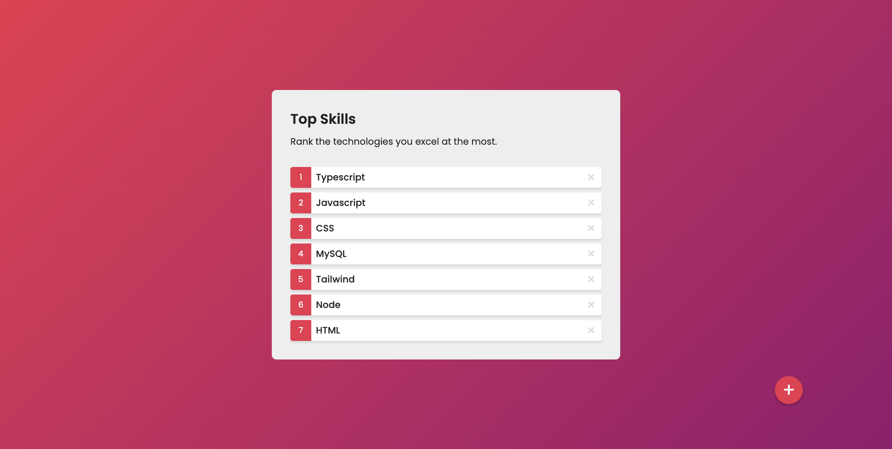
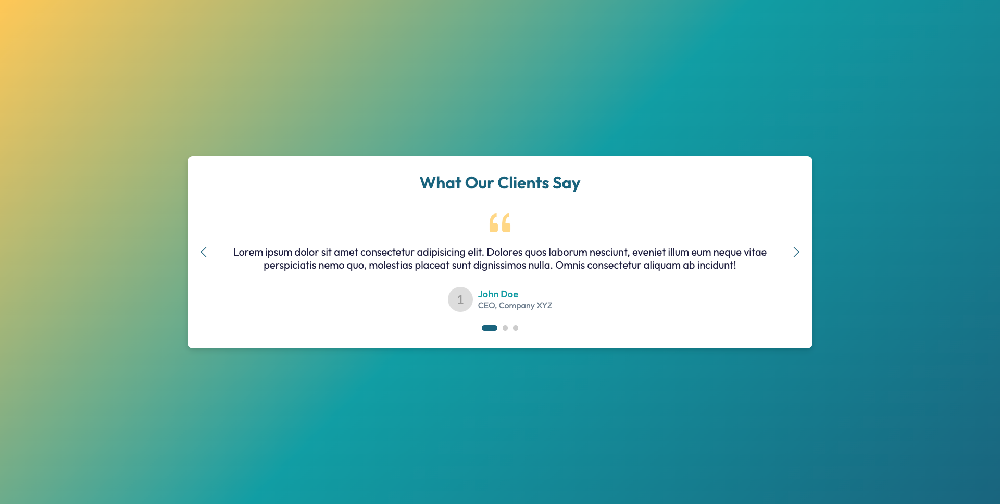
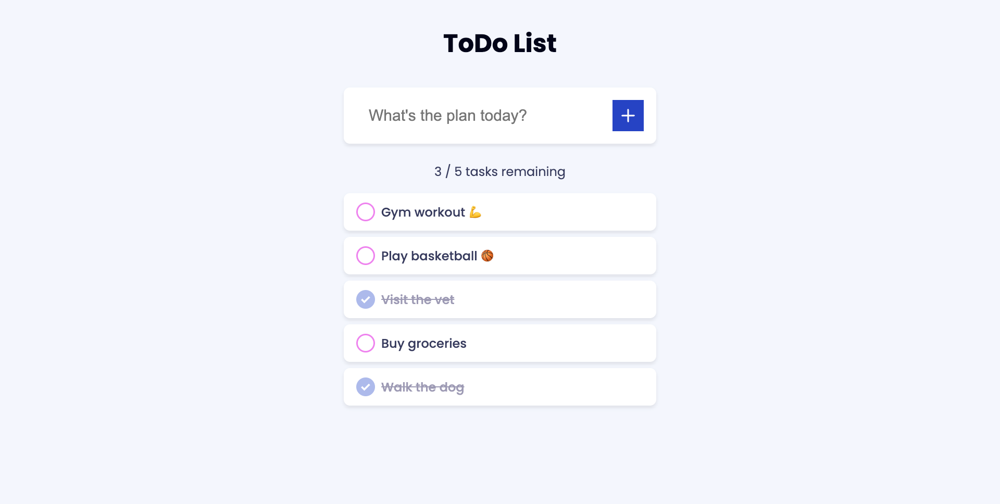
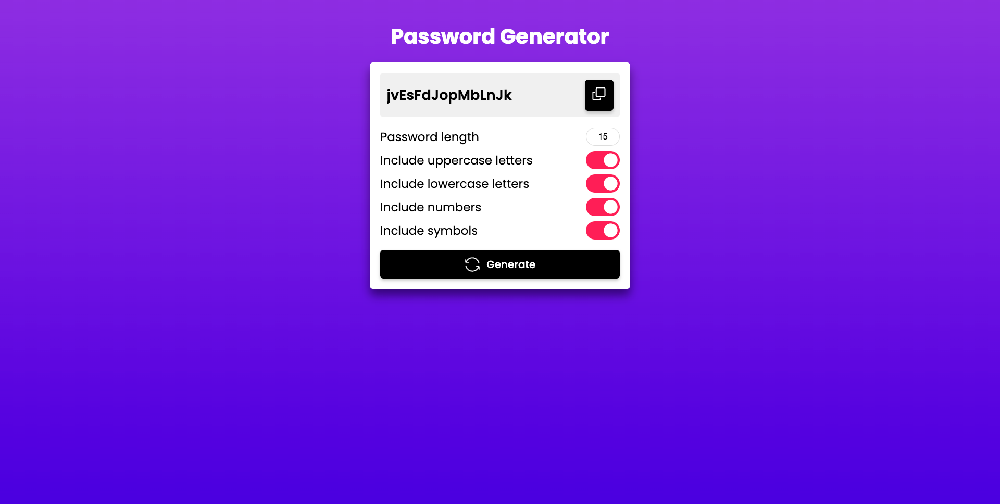

# 📦 Media Projects Monorepo

> Bộ sưu tập 25+ ứng dụng web bao gồm nền tảng nghe nhạc, công cụ tiện ích, ứng dụng năng suất và mạng xã hội.
> 
> A comprehensive collection of 25+ web applications including music streaming, utility tools, productivity apps, and social media.


---

## 📋 Mục Lục | Table of Contents

<details>
<summary><b>🇻🇳 Tiếng Việt</b></summary>

- [Tổng Quan](#-tổng-quan)
- [Cấu Trúc Dự Án](#-cấu-trúc-dự-án)
- [Hệ Sinh Thái Nhạc](#-hệ-sinh-thái-nhạc)
- [Ứng Dụng Tiện Ích](#-ứng-dụng-tiện-ích)
- [Ứng Dụng Phức Tạp](#-ứng-dụng-phức-tạp)
- [Mạng Xã Hội](#-mạng-xã-hội)
- [Công Nghệ Sử Dụng](#-công-nghệ-sử-dụng)
- [Bắt Đầu](#-bắt-đầu)
- [Triển Khai](#-triển-khai)
- [Scripts & Công Cụ](#-scripts--công-cụ)
- [Patterns Chung](#-patterns-chung)
- [Giấy Phép](#-giấy-phép)

</details>

<details>
<summary><b>🇺🇸 English</b></summary>

- [Overview](#-overview)
- [Project Structure](#-project-structure)
- [Music Ecosystem](#-music-ecosystem)
- [Utility Applications](#-utility-applications)
- [Complex Applications](#-complex-applications)
- [Social Media Apps](#-social-media-apps)
- [Technology Stack](#-technology-stack)
- [Getting Started](#-getting-started)
- [Deployment](#-deployment)
- [Scripts & Tools](#-scripts--tools)
- [Common Patterns](#-common-patterns)
- [License](#-license)

</details>

---

<div id="vietnamese"></div>

## 🇻🇳 PHẦN TIẾNG VIỆT

---

## 🎯 Tổng Quan

Kho lưu trữ này chứa bộ sưu tập đa dạng các ứng dụng web được xây dựng với nhiều công nghệ khác nhau:

- **Vanilla JavaScript** - Ứng dụng tiện ích nhẹ, dựa trên module
- **React + Vite** - Ứng dụng hiện đại dựa trên component
- **Python Flask** - Dịch vụ API backend
- **Supabase** - Ứng dụng đồng bộ đám mây với database real-time

Tất cả dự án tuân theo **quy trình production/beta** để kiểm thử và triển khai tính năng an toàn.

---

## 📁 Cấu Trúc Dự Án

```
media/
├── 🎵 Hệ Sinh Thái Nhạc
│   ├── music/                    # File nhạc nguồn (52+ bài)
│   ├── load-track/               # Metadata track chính
│   ├── MusicPro.com/             # Production (Vanilla JS)
│   ├── MusicPro.com-beta/        # Biến thể testing
│   ├── MusicPro.com-python/      # Flask backend
│   ├── MusicPro.com-supabase/    # Phiên bản cloud-sync
│   ├── MusicPro.com-vite/        # React production
│   └── MusicPro.com-vite-beta/   # React testing
│
├── 🛠️ Ứng Dụng Tiện Ích
│   ├── DiemNgay.com/             # Đếm ngược thời gian
│   ├── DiemNguoc.com/            # Đếm số
│   ├── DongHo.com/               # Đồng hồ analog
│   ├── ImageSlider.com/          # Slider hình ảnh
│   ├── ShoppingList.com/         # Danh sách mua sắm
│   ├── SortableList.com/         # Danh sách sắp xếp
│   ├── TestimonialSlider.com/    # Slider đánh giá
│   ├── ThoiTiet.com/             # Ứng dụng thời tiết
│   ├── TodoList.com/             # Danh sách việc cần làm
│   ├── TrangDangKy.com/          # Form đăng ký nhiều bước
│   ├── TrinhTaoMatKhau.com/      # Tạo mật khẩu
│   └── SuaAnh.com/               # Chỉnh sửa ảnh
│
├── 🚀 Ứng Dụng Phức Tạp
│   ├── HinhNenDep.com/           # Thư viện hình nền (VN)
│   ├── HinhNenDep.com-beta/
│   ├── QLChiTieu.com/            # Quản lý chi tiêu + biểu đồ
│   ├── QLChiTieu.com-beta/
│   ├── TroLyAo.com/              # Trợ lý AI chatbot
│   └── TroLyAo.com-beta/
│
├── 📱 Mạng Xã Hội
│   ├── Instagram.com/            # Instagram clone (React + Supabase)
│   └── Instagram.com-beta/
│
├── 📦 Tài Nguyên Chung
│   ├── ThuVienChinh/             # Tài nguyên chia sẻ (favicons, avatars)
│   └── .github/                  # GitHub Actions workflows
│
└── 🔧 Scripts & Công Cụ
    ├── deploy.py                 # Script tự động deploy
    ├── update.py                 # Đồng bộ Beta → Production
    ├── tracks.py                 # Đồng bộ metadata nhạc
    ├── server.py                 # Multi-project WSGI server
    ├── index.py                  # Tạo trang hub HTML
    └── download_folder.py        # Tool tải folder từ GitHub
```

---

## 🎵 Hệ Sinh Thái Nhạc

### MusicPro.com Variants

| Variant | Công Nghệ | Tính Năng | Screenshot |
|---------|-----------|-----------|------------|
| **MusicPro.com** | Vanilla JS + Three.js | Trình nghe nhạc đầy đủ: tìm kiếm, yêu thích, lời bài hát, visualizer 3D, hẹn giờ ngủ, equalizer |  |
| **MusicPro.com-beta** | Vanilla JS | Môi trường testing tính năng mới |  |
| **MusicPro.com-python** | Flask REST API | Backend với `/api/tracks`, `/api/favorites`, `/api/history`, `/api/settings`, `/api/playlist` |  |
| **MusicPro.com-supabase** | Vanilla JS + Supabase | Đồng bộ đám mây yêu thích, playlist, cài đặt across devices |  |
| **MusicPro.com-vite** | React + Vite | React implementation với React Router, Context API |  |
| **MusicPro.com-vite-beta** | React + Vite | React testing variant |  |

### Thư Viện Nhạc

Folder `music/` chứa **52+ bộ nhạc hoàn chỉnh**, mỗi bộ gồm:
- `1.lrc` - Lời bài hát đồng bộ
- `2.mp3` - Audio chính
- `3.mp3` - Beat/instrumental
- `4.mp4` - Music video
- `cover.jpg` - Ảnh bìa album

#### Album Mẫu

| | | | |
|-|-|-|-|
|  |  |  |  |
| *Yêu Em Nhưng Không Với Tới* | *Xuân Vu Quy* | *With You* | *Tình Yêu Không Có Lỗi* |
|  |  |  |  |
| *Tết Này Có Nhau* | *Mãnh Tình Sai Đôi* | *Hỏi Vợ Ngoại Thành* | *Địa Đàng* |

Thể loại bao gồm: nhạc Việt, EDM remix, nhạc Tết, và các bản hit phổ biến.

---

## 🛠️ Ứng Dụng Tiện Ích

Công cụ nhẹ, đơn mục đích xây dựng bằng Vanilla JavaScript và ES6 modules:

| Ứng Dụng | Mô Tả | Screenshot |
|----------|-------|------------|
| **DiemNgay.com** | Đếm ngược đến sự kiện với thông báo âm thanh |  |
| **DiemNguoc.com** | Đếm số cấu hình được với increment/decrement và giới hạn |  |
| **DongHo.com** | Đồng hồ analog với kim giây mượt và 60 vạch chia |  |
| **ImageSlider.com** | Carousel hình ảnh responsive với auto-slide và cảm ứng |  |
| **ShoppingList.com** | Danh sách mua sắm CRUD với drag-drop sorting và filtering |  |
| **SortableList.com** | Danh sách xếp hạng drag-drop để sắp xếp items |  |
| **TestimonialSlider.com** | Carousel đánh giá khách hàng với swipe gestures |  |
| **ThoiTiet.com** | Ứng dụng thời tiết với tìm kiếm thành phố, đổi đơn vị, chỉ số chi tiết |  |
| **TodoList.com** | Quản lý task cổ điển với thêm/hoàn thành/xóa |  |
| **TrangDangKy.com** | Wizard đăng ký 4 bước với thanh tiến trình |  |
| **TrinhTaoMatKhau.com** | Tạo mật khẩu (6-120 ký tự) với tùy chọn tùy chỉnh |  |
| **SuaAnh.com** | Chỉnh sửa ảnh với filters, preview, và lưu |  |

---

## 🚀 Ứng Dụng Phức Tạp

### HinhNenDep.com 🖼️
Ứng dụng thư viện hình nền tiếng Việt.


- **Tính năng**: Tìm kiếm, danh mục, yêu thích, lazy loading, tải xuống
- **Công nghệ**: Vanilla JS ES6 Modules, localStorage
- **Ngôn ngữ**: Giao diện tiếng Việt

### QLChiTieu.com 💰
Theo dõi chi tiêu và tài chính cá nhân.


- **Tính năng**: Giao dịch, ngân sách, biểu đồ Chart.js, lọc danh mục, xem theo thời gian (ngày/tuần/tháng/năm), xuất CSV, widget tỷ giá
- **Công nghệ**: Vanilla JS + Chart.js + Node.js/Express backend
- **Lưu trữ**: localStorage + dữ liệu server

### TroLyAo.com 🤖
Trợ lý chatbot AI ("Trợ Lý DeepSeek").


- **Tính năng**: Nhập liệu văn bản/giọng nói (SpeechRecognition), xuất văn bản thành giọng nói, lịch sử chat, sidebar responsive mobile
- **Công nghệ**: Vanilla JS ES6 Modules, Web Speech API
- **Ngôn ngữ**: Giao diện tiếng Việt

---

## 📱 Mạng Xã Hội

### Instagram.com
Instagram clone đầy đủ tính năng với các tính năng xã hội toàn diện.

**Tính năng**:
- 🔐 Xác thực (Supabase Auth)
- 📸 Bài đăng với hình ảnh
- ❤️ Likes & Comments
- 📱 Stories & Highlights
- 🔖 Bookmarks
- 💬 Tin nhắn trực tiếp
- 🔔 Thông báo
- 👥 Theo dõi/Bỏ theo dõi

**Công nghệ**: React + Vite + Supabase (Auth + Database + Storage)

---

## 💻 Công Nghệ Sử Dụng

| Công Nghệ | Dự Án |
|-----------|-------|
| **Vanilla JavaScript (ES6 Modules)** | 15+ ứng dụng tiện ích, MusicPro.com, HinhNenDep.com, QLChiTieu.com, TroLyAo.com |
| **React + Vite** | Instagram.com, MusicPro.com-vite |
| **Python Flask** | MusicPro.com-python |
| **Supabase** | Instagram.com, MusicPro.com-supabase |
| **Node.js/Express** | QLChiTieu.com |
| **Chart.js** | QLChiTieu.com |
| **Three.js** | MusicPro.com (visualizer audio 3D) |

---

## 📦 Tài Nguyên Chung

### ThuVienChinh (Tài Nguyên Chia Sẻ)

| Danh Mục | Nội Dung | Preview |
|----------|----------|---------|
| **Favicon** | Bộ favicon đầy đủ (16x16, 32x32, apple-touch-icon, android-chrome) |  |
| **Avatar** | Avatar người dùng mặc định |  |
| **Stickers** | GIF reaction cho ứng dụng chat |    |

### Audio Assets

| File | Sử Dụng |
|------|---------|
| `Love.m4a` | Nhạc nền / thông báo |
| `TRTD.m4a` | Hiệu ứng âm thanh chủ đề |

---

## 🚀 Bắt Đầu

### Yêu Cầu Hệ Thống

- **Python 3.8+** (cho Flask apps và scripts)
- **Node.js 18+** (cho React/Vite projects)
- **Git** (cho version control và deployment)

### Cài Đặt

1. **Clone repository**:
```bash
git clone https://github.com/your-username/media.git
cd media
```

2. **Cài đặt Python dependencies** (cho Flask projects):
```bash
pip install flask flask-cors
```

3. **Cài đặt Node dependencies** (cho React projects):
```bash
cd Instagram.com
npm install
```

4. **Khởi động multi-project server**:
```bash
python server.py
```

5. **Truy cập trang hub**:
```bash
python index.py
# Mở http://localhost:8000 trong browser
```

---

## 📦 Triển Khai

### Tự Động Deploy

Repository bao gồm hệ thống deploy tinh vi:

```bash
# Deploy với auto-commit
python deploy.py

# Deploy với message tùy chỉnh
python deploy.py -m "Thêm tính năng mới"

# Deploy không cần xác nhận
python deploy.py -y
```

### Đồng Bộ Beta → Production

Cập nhật production folders từ beta variants:

```bash
python update.py
```

Script này:
- Copy tất cả files từ `-beta` folders sang production
- Loại trừ `tracks.js` và `node_modules`
- Xử lý các trường hợp đặc biệt (ví dụ: `MusicPro.com-vite-beta` trong home directory)

### Đồng Bộ Metadata Nhạc

Đồng bộ track metadata across tất cả MusicPro variants:

```bash
python tracks.py
```

---

## 🔧 Scripts & Công Cụ

| Script | Mục Đích |
|--------|----------|
| **deploy.py** | Git deployment nâng cao với auto-repair, spinner animations, smart commit messages, remote sync. Hỗ trợ flags `-y` (auto-confirm) và `-m` (custom message) |
| **update.py** | Đồng bộ beta → production folders, loại trừ `tracks.js` và `node_modules` |
| **tracks.py** | Đồng bộ music metadata từ `music/` folder sang tất cả `tracks.js` files của MusicPro.com variants |
| **server.py** | Multi-project WSGI server (port 1515) phục vụ Flask apps (.py) và static HTML files. Hỗ trợ Cloudflare Tunnel |
| **index.py** | Tạo trang hub HTML liệt kê tất cả projects với dynamic IP detection (local network + Cloudflare Tunnel) |
| **download_folder.py** | GitHub folder downloader tương tác với progress bars và speed indicators |

---

## 🔄 Patterns Chung

### 1. Quy Trình Beta/Production
Mỗi project chính có variant `-beta` để testing trước khi deploy production.

### 2. LocalStorage Persistence
Ứng dụng Vanilla JS dùng `localStorage` cho dữ liệu người dùng (favorites, settings, history).

### 3. Responsive Design
Tất cả projects mobile-first với CSS responsive.

### 4. PWA Support
Projects bao gồm bộ favicon với `site.webmanifest` cho khả năng Progressive Web App.

### 5. Shared Track System
Tất cả MusicPro.com variants chia sẻ cùng data structure `tracks.js`.

### 6. Cloudflare Tunnel Integration
`server.py` hỗ trợ Cloudflare Tunnel cho public access tới local development servers.

### 7. Đặt Tên Media Nhất Quán
Music files theo pattern: `1.lrc`, `2.mp3`, `3.mp3` (instrumental), `4.mp4`.

### 8. GitHub Actions
Automated deployment workflows qua `.github/` folders trong mỗi project.

---

## 📄 Giấy Phép

Dự án này được cấp phép theo Giấy phép MIT - xem file [LICENSE](LICENSE) để biết chi tiết.

---

## 🤝 Đóng Góp

1. Tạo feature branch từ beta variant
2. Kiểm thử kỹ trong môi trường beta
3. Chạy `python update.py` để đồng bộ sang production
4. Commit và deploy bằng `python deploy.py`

---

## 📞 Hỗ Trợ

Đối với vấn đề hoặc câu hỏi, vui lòng mở issue trên GitHub repository.

---

**Built with ❤️ by d4m-dev**

---

<div id="english"></div>

## 🇺🇸 ENGLISH SECTION

---

## 🎯 Overview

This repository contains a diverse collection of web applications built with various technologies:

- **Vanilla JavaScript** - Lightweight, module-based utility apps
- **React + Vite** - Modern component-based applications
- **Python Flask** - Backend API services
- **Supabase** - Cloud-synced applications with real-time database

All projects follow a **production/beta workflow** for safe feature testing and deployment.

---

## 📁 Project Structure

```
media/
├── 🎵 Music Ecosystem
│   ├── music/                    # Source media files (52+ songs)
│   ├── load-track/               # Master track metadata
│   ├── MusicPro.com/             # Production (Vanilla JS)
│   ├── MusicPro.com-beta/        # Testing variant
│   ├── MusicPro.com-python/      # Flask backend
│   ├── MusicPro.com-supabase/    # Cloud-sync version
│   ├── MusicPro.com-vite/        # React production
│   └── MusicPro.com-vite-beta/   # React testing
│
├── 🛠️ Utility Applications
│   ├── DiemNgay.com/             # Countdown timer
│   ├── DiemNguoc.com/            # Counter app
│   ├── DongHo.com/               # Analog clock
│   ├── ImageSlider.com/          # Image carousel
│   ├── ShoppingList.com/         # Shopping list with drag-drop
│   ├── SortableList.com/         # Sortable ranking list
│   ├── TestimonialSlider.com/    # Testimonial carousel
│   ├── ThoiTiet.com/             # Weather app
│   ├── TodoList.com/             # Classic todo list
│   ├── TrangDangKy.com/          # Multi-step registration
│   ├── TrinhTaoMatKhau.com/      # Password generator
│   └── SuaAnh.com/               # Image editor
│
├── 🚀 Complex Applications
│   ├── HinhNenDep.com/           # Wallpaper gallery (VN)
│   ├── HinhNenDep.com-beta/
│   ├── QLChiTieu.com/            # Expense tracker + charts
│   ├── QLChiTieu.com-beta/
│   ├── TroLyAo.com/              # AI chatbot assistant
│   └── TroLyAo.com-beta/
│
├── 📱 Social Media Apps
│   ├── Instagram.com/            # Instagram clone (React + Supabase)
│   └── Instagram.com-beta/
│
├── 📦 Shared Resources
│   ├── ThuVienChinh/             # Shared assets (favicons, avatars)
│   └── .github/                  # GitHub Actions workflows
│
└── 🔧 Scripts & Tools
    ├── deploy.py                 # Auto-deployment script
    ├── update.py                 # Beta → Production sync
    ├── tracks.py                 # Music metadata sync
    ├── server.py                 # Multi-project WSGI server
    ├── index.py                  # HTML hub generator
    └── download_folder.py        # GitHub folder downloader
```

---

## 🎵 Music Ecosystem

### MusicPro.com Variants

| Variant | Technology | Features | Screenshot |
|---------|------------|----------|------------|
| **MusicPro.com** | Vanilla JS + Three.js | Full-featured music player with search, favorites, lyrics, 3D visualizer, sleep timer, equalizer |  |
| **MusicPro.com-beta** | Vanilla JS | Testing ground for new features |  |
| **MusicPro.com-python** | Flask REST API | Backend with `/api/tracks`, `/api/favorites`, `/api/history`, `/api/settings`, `/api/playlist` |  |
| **MusicPro.com-supabase** | Vanilla JS + Supabase | Cloud sync for favorites, playlists, settings across devices |  |
| **MusicPro.com-vite** | React + Vite | Modern React implementation with React Router, Context API |  |
| **MusicPro.com-vite-beta** | React + Vite | React testing variant |  |

### Music Library

The `music/` folder contains **52+ complete song packages**, each with:
- `1.lrc` - Synchronized lyrics
- `2.mp3` - Main audio track
- `3.mp3` - Instrumental/beat version
- `4.mp4` - Music video
- `cover.jpg` - Album artwork

#### Sample Album Covers

| | | | |
|-|-|-|-|
|  |  |  |  |
| *Yêu Em Nhưng Không Với Tới* | *Xuân Vu Quy* | *With You* | *Tình Yêu Không Có Lỗi* |
|  |  |  |  |
| *Tết Này Có Nhau* | *Mãnh Tình Sai Đôi* | *Hỏi Vợ Ngoại Thành* | *Địa Đàng* |

Genres include Vietnamese music, EDM remixes, holiday songs, and popular hits.

---

## 🛠️ Utility Applications

Lightweight, single-purpose tools built with vanilla JavaScript and ES6 modules:

| App | Description | Screenshot |
|-----|-------------|------------|
| **DiemNgay.com** | Countdown timer to specific events with sound notifications |  |
| **DiemNguoc.com** | Configurable counter with increment/decrement and limits |  |
| **DongHo.com** | Analog clock with smooth second hand and 60 tick marks |  |
| **ImageSlider.com** | Responsive image carousel with auto-slide and touch support |  |
| **ShoppingList.com** | CRUD shopping list with drag-drop sorting and filtering |  |
| **SortableList.com** | Drag-drop ranking list for organizing items |  |
| **TestimonialSlider.com** | Customer testimonial carousel with swipe gestures |  |
| **ThoiTiet.com** | Weather app with city search, unit toggle, detailed metrics |  |
| **TodoList.com** | Classic task manager with add/complete/delete |  |
| **TrangDangKy.com** | 4-step registration wizard with progress bar |  |
| **TrinhTaoMatKhau.com** | Password generator (6-120 chars) with customizable options |  |
| **SuaAnh.com** | Image editor with filters, preview, and save functionality |  |

---

## 🚀 Complex Applications

### HinhNenDep.com 🖼️
Vietnamese wallpaper gallery application.


- **Features**: Search, categories, favorites, lazy loading, download
- **Tech**: Vanilla JS ES6 Modules, localStorage
- **Language**: Vietnamese interface

### QLChiTieu.com 💰
Personal finance and expense tracking.


- **Features**: Transactions, budgeting, Chart.js visualizations, category filtering, time-based views (day/week/month/year), CSV export, exchange rate widget
- **Tech**: Vanilla JS + Chart.js + Node.js/Express backend
- **Storage**: localStorage + server-side data

### TroLyAo.com 🤖
AI chatbot assistant ("Trợ Lý DeepSeek").


- **Features**: Text/voice input (SpeechRecognition), text-to-speech output, chat history, mobile-responsive sidebar
- **Tech**: Vanilla JS ES6 Modules, Web Speech API
- **Language**: Vietnamese interface

---

## 📱 Social Media Apps

### Instagram.com
Full-featured Instagram clone with comprehensive social features.

**Features**:
- 🔐 Authentication (Supabase Auth)
- 📸 Posts with images
- ❤️ Likes & Comments
- 📱 Stories & Highlights
- 🔖 Bookmarks
- 💬 Direct Messages
- 🔔 Notifications
- 👥 Follow/Unfollow system

**Tech Stack**: React + Vite + Supabase (Auth + Database + Storage)

---

## 💻 Technology Stack

| Technology | Projects |
|------------|----------|
| **Vanilla JavaScript (ES6 Modules)** | 15+ utility apps, MusicPro.com, HinhNenDep.com, QLChiTieu.com, TroLyAo.com |
| **React + Vite** | Instagram.com, MusicPro.com-vite |
| **Python Flask** | MusicPro.com-python |
| **Supabase** | Instagram.com, MusicPro.com-supabase |
| **Node.js/Express** | QLChiTieu.com |
| **Chart.js** | QLChiTieu.com |
| **Three.js** | MusicPro.com (3D audio visualization) |

---

## 📦 Shared Resources

### ThuVienChinh (Shared Assets)

| Category | Contents | Preview |
|----------|----------|---------|
| **Favicon** | Complete favicon set (16x16, 32x32, apple-touch-icon, android-chrome) |  |
| **Avatar** | Default user avatar |  |
| **Stickers** | Reaction GIFs for chat apps |    |

### Audio Assets

| File | Usage |
|------|-------|
| `Love.m4a` | Background music / notification sound |
| `TRTD.m4a` | Theme sound effect |

---

## 🚀 Getting Started

### Prerequisites

- **Python 3.8+** (for Flask apps and scripts)
- **Node.js 18+** (for React/Vite projects)
- **Git** (for version control and deployment)

### Installation

1. **Clone the repository**:
```bash
git clone https://github.com/your-username/media.git
cd media
```

2. **Install Python dependencies** (for Flask projects):
```bash
pip install flask flask-cors
```

3. **Install Node dependencies** (for React projects):
```bash
cd Instagram.com
npm install
```

4. **Start the multi-project server**:
```bash
python server.py
```

5. **Access the hub page**:
```bash
python index.py
# Open http://localhost:8000 in your browser
```

---

## 📦 Deployment

### Automated Deployment

The repository includes a sophisticated deployment system:

```bash
# Deploy with auto-commit
python deploy.py

# Deploy with custom message
python deploy.py -m "Add new feature"

# Deploy without confirmation prompt
python deploy.py -y
```

### Beta → Production Sync

Update production folders from beta variants:

```bash
python update.py
```

This script:
- Copies all files from `-beta` folders to production
- Excludes `tracks.js` and `node_modules`
- Handles special cases (e.g., `MusicPro.com-vite-beta` in home directory)

### Music Metadata Sync

Synchronize track metadata across all MusicPro variants:

```bash
python tracks.py
```

---

## 🔧 Scripts & Tools

| Script | Purpose |
|--------|---------|
| **deploy.py** | Advanced Git deployment with auto-repair, spinner animations, smart commit messages, remote sync. Supports `-y` (auto-confirm) and `-m` (custom message) flags |
| **update.py** | Sync beta → production folders, excluding `tracks.js` and `node_modules` |
| **tracks.py** | Sync music metadata from `music/` folder to all MusicPro.com variants' `tracks.js` files |
| **server.py** | Multi-project WSGI server (port 1515) serving Flask apps (.py) and static HTML files. Supports Cloudflare Tunnel |
| **index.py** | Generate HTML hub page listing all projects with dynamic IP detection (local network + Cloudflare Tunnel) |
| **download_folder.py** | Interactive GitHub folder downloader with progress bars and speed indicators |

---

## 🔄 Common Patterns

### 1. Beta/Production Workflow
Every major project has a `-beta` variant for testing before production deployment.

### 2. LocalStorage Persistence
Vanilla JS apps use `localStorage` for user data (favorites, settings, history).

### 3. Responsive Design
All projects are mobile-first with responsive CSS.

### 4. PWA Support
Projects include favicon sets with `site.webmanifest` for Progressive Web App capabilities.

### 5. Shared Track System
All MusicPro.com variants share the same `tracks.js` data structure.

### 6. Cloudflare Tunnel Integration
`server.py` supports Cloudflare Tunnel for public access to local development servers.

### 7. Consistent Media Naming
Music files follow the pattern: `1.lrc`, `2.mp3`, `3.mp3` (instrumental), `4.mp4`.

### 8. GitHub Actions
Automated deployment workflows via `.github/` folders in each project.

---

## 📄 License

This project is licensed under the MIT License - see the [LICENSE](LICENSE) file for details.

---

## 🤝 Contributing

1. Create a feature branch from the beta variant
2. Test thoroughly in the beta environment
3. Run `python update.py` to sync to production
4. Commit and deploy using `python deploy.py`

---

## 📞 Support

For issues or questions, please open an issue on the GitHub repository.

---

**Built with ❤️ by d4m-dev**
