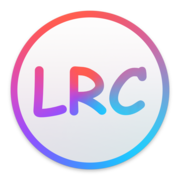

<p align="center">
    <a href="https://lrc-maker.github.io">
        
    </a>
</p>

<div align="center">

[Tiếng Việt](./README-vi.md) · [English](./README.md) · [中文](./README-zh.md)

</div>

# [Trình Tạo Lyric LRC][lrc maker] &middot; [](https://github.com/magic-akari/lrc-maker/actions/workflows/build.yml)

## Đây là gì

Đây là công cụ tạo file LRC (lời bài hát có kèm timestamp) để hiển thị lời đồng bộ với nhạc.

## Tại sao dùng LRC Maker

Tôi không hài lòng với các công cụ hiện có, chúng không thể sử dụng đa nền tảng. Vì vậy tôi đã tự tạo ra công cụ này.

## Cách sử dụng

Nhấp vào [lrc-maker][lrc maker] để bắt đầu. Bạn có thể thêm liên kết vào dấu trang trình duyệt. Kéo và thả file nhạc vào trang để tải lên và sử dụng phím mũi tên cùng phím space để chèn timestamp.

Liên kết nhánh phát triển:

- https://magic-akari.github.io/lrc-maker/
- https://lrc-maker.vercel.app/

## Phím tắt

|                               phím                              |          chức năng          |
| :-------------------------------------------------------------: | :-------------------------: |
|                      <kbd>space</kbd>                           |   chèn timestamp   |
|   <kbd>backspace</kbd> / <kbd>delete</kbd> / <kbd>⌫</kbd>       |   xóa timestamp   |
| <kbd>ctrl</kbd><kbd>enter↵</kbd> / <kbd>⌘</kbd><kbd>↩</kbd>     |        phát / tạm dừng       |
|                  <kbd>←</kbd> / <kbd>A</kbd>                    |   lùi 5 giây   |
|                  <kbd>→</kbd> / <kbd>D</kbd>                    |   tới 5 giây   |
|          <kbd>↑</kbd> / <kbd>W</kbd> / <kbd>J</kbd>             |    chọn dòng trước    |
|          <kbd>↓</kbd> / <kbd>S</kbd> / <kbd>K</kbd>             |      chọn dòng sau      |
|                  <kbd>-</kbd> / <kbd>+</kbd>                    |   điều chỉnh timestamp   |
|   <kbd>ctrl</kbd><kbd>↑</kbd> / <kbd>⌘</kbd><kbd>↑</kbd>        |   tăng tốc độ phát   |
|   <kbd>ctrl</kbd><kbd>↓</kbd> / <kbd>⌘</kbd><kbd>↓</kbd>        |   giảm tốc độ phát   |
|                         <kbd>R</kbd>                            |   đặt lại tốc độ phát    |

## Tương thích

Hầu hết các trình duyệt hiện đại đều được hỗ trợ. Phiên bản hiện tại sử dụng nhiều API trình duyệt hiện đại để cải thiện hiệu suất và trải nghiệm người dùng. Dự án này sử dụng ES Module để tải mã script, có nghĩa là phiên bản trình duyệt phải đáp ứng các yêu cầu sau:

| trình duyệt | phiên bản |
| :---------- | :-------- |
| EDGE        | >= 16     |
| Firefox     | >= 60     |
| Chrome      | >= 61     |
| Safari      | >= 11     |
| ios_saf     | >= 11     |

Hỗ trợ hạn chế cho trình duyệt EDGE.

Các trình duyệt không hỗ trợ ES Module sẽ tải script dự phòng. Lưu ý: Script dự phòng chưa được kiểm tra. Các trình duyệt cũ có thể gặp nhầm lẫn về bố cục CSS.

Các trình duyệt cổ như IE không còn được hỗ trợ. Nếu bạn là người dùng trình duyệt cổ, hãy sử dụng [phiên bản cũ][version 3.x] của dự án này.

## Phát triển

Nếu bạn muốn chạy dự án này trên máy tính của mình, hãy làm theo hướng dẫn:

```bash
# clone repo này
git clone https://github.com/magic-akari/lrc-maker.git

cd lrc-maker

# cài đặt dependencies
npm i

# build
npm run build

# hoặc build với watch mode
npm start
```

## Triển khai production

Sau khi build (`npm run build`), thư mục `build` chứa các file website tĩnh.
Bạn có thể triển khai nó lên bất kỳ CDN hoặc máy chủ file tĩnh nào.

Bạn cũng có thể build Docker image bằng cách sử dụng `Dockerfile` tại gốc repo này.
Nó sẽ chạy build và cung cấp cho bạn image nginx tối giản.

```bash
# build image
docker build -t lrc-maker .
# tạo container và chạy ở port 8080
docker run -d -p 8080:80 lrc-maker
```

## Yêu thích dự án này :star:

Nếu bạn thích, hãy cho chúng tôi một sao :star: Cũng như chia sẻ dự án này để giúp đỡ nhiều người hơn.

---

[lrc maker]: https://lrc-maker.github.io
[version 3.x]: https://lrc-maker.github.io/3.x
